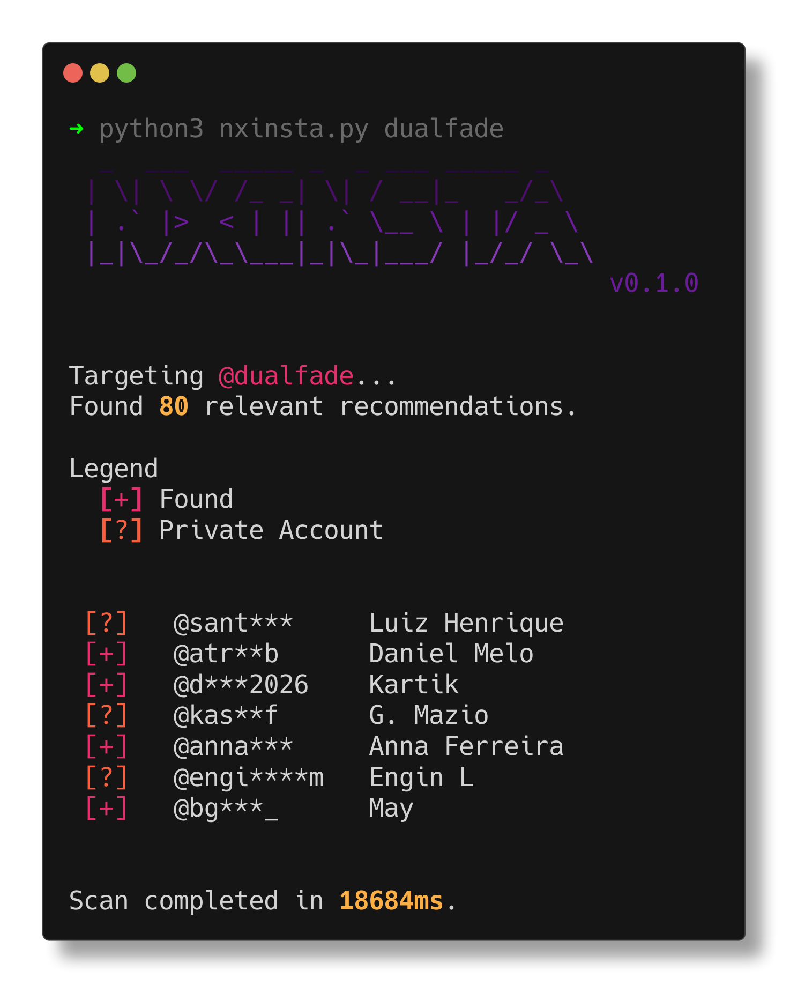

<p align="center">
  <br>
  <span>Infer private social connections on Instagram using recommendation analysis</span>
  <br>
</p>

> [!WARNING]  
> Using this tool may result in temporary or permanent restrictions on your Instagram account. It is **highly recommended** to use an alternate (burner) account instead of your primary one.

<p align="center">

</p>

<p align="center">
  <a href="#installation">Installation</a>
  &nbsp;&nbsp;&nbsp;•&nbsp;&nbsp;&nbsp;
  <a href="#usage">Usage</a>
  &nbsp;&nbsp;&nbsp;•&nbsp;&nbsp;&nbsp;
  <a href="#how-it-works">How it works</a>
</p>

## Installation

```bash
# clone the repository
git clone https://github.com/pwnfo/nxinsta.git

# enter the directory
cd nxinsta

# install dependencies
pip3 install -r requirements.txt
```

## Usage

To start analyzing a target profile:

```bash
python3 nxinsta.py @username
```

### Command Line Options

```console
$ python3 nxinsta.py --help
usage: nxinsta [options] @target

Infer private social connections on Instagram
using recommendation analysis.

Options:
  -h, --help           display this help message
  -v, --version        show version
  -m <max>, --max <max>
                       max accounts to enumerate (default: 24)
  -l <user:pass>, --login <user:pass>
                       login with credentials
  -s <path>, --session <path>
                       path to session file (default: .nxinsta_session.json)
  -o <path>, --output <path>
                       save results to a file
```

## How it works

NxInsta utilizes the "Suggested for you" feature of Instagram. When you visit a profile, Instagram suggests similar or related accounts. By programmatically exploring these suggestions and applying filters (like removing mutual followers), the tool identifies accounts that are likely part of the target's inner circle or private network.

## License

MIT © Ryan R. &lt;pwnfo@proton.me&gt;
